Download source code

Run npm install

Setup all microservices

Test all business logic with POSTMAN

-REGISTER

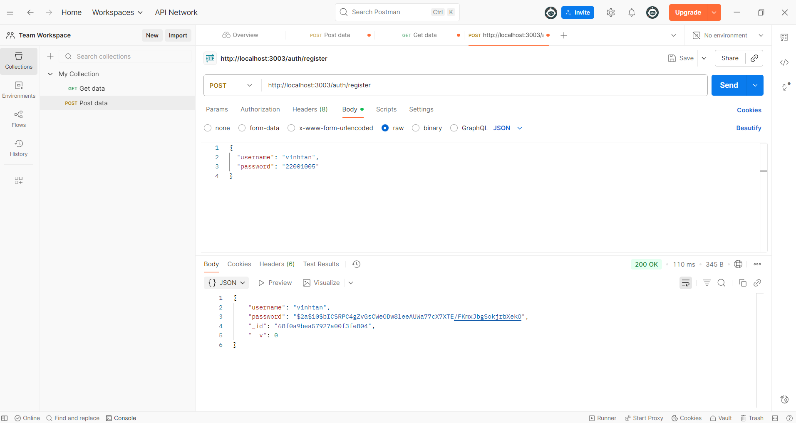

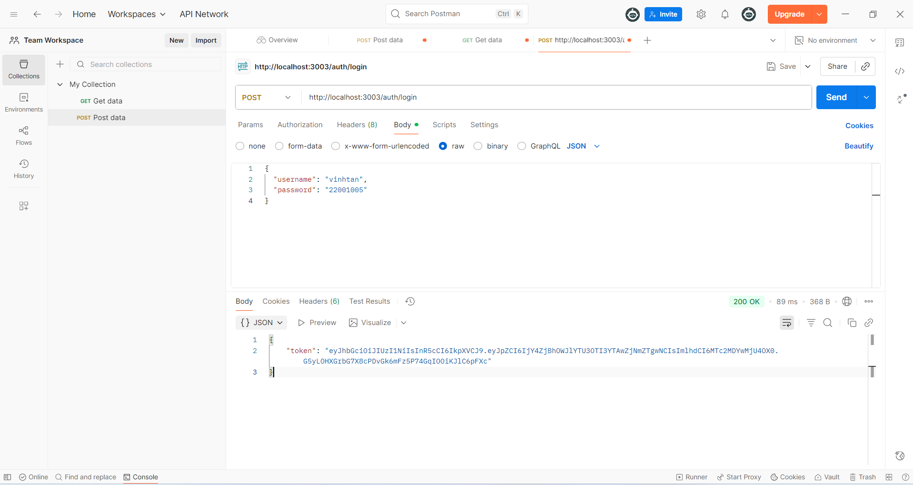

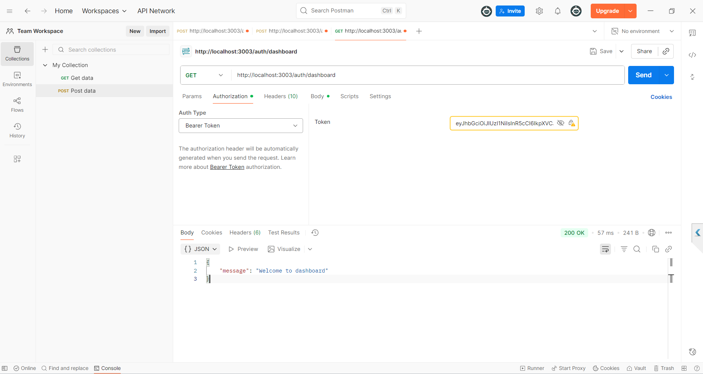

 - TRUONG HOP DA DANG KY TEN DO :
 {"message":"Username already taken"}
 

-LOGIN

-NHAP SAI USERNAME OR PASSWORD
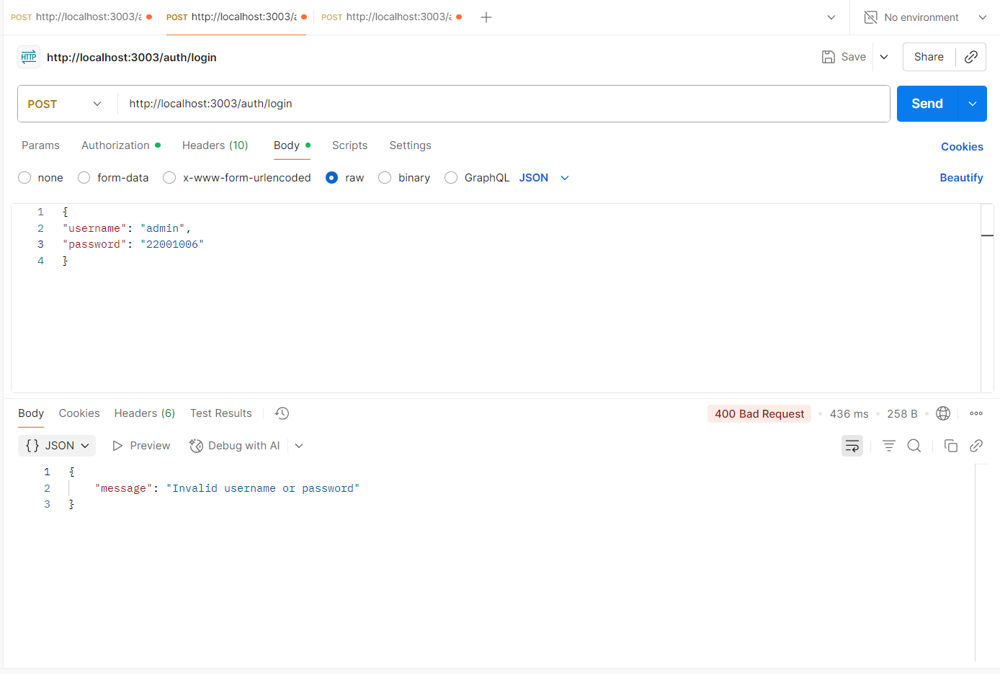

-CREATE PRODUCT
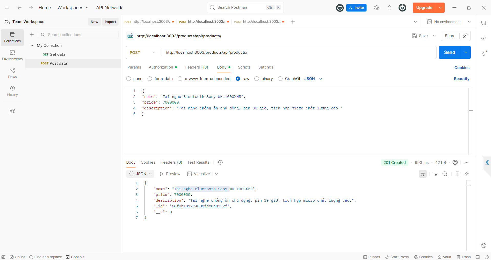

 - ERROR CREATE PRODUCT 
 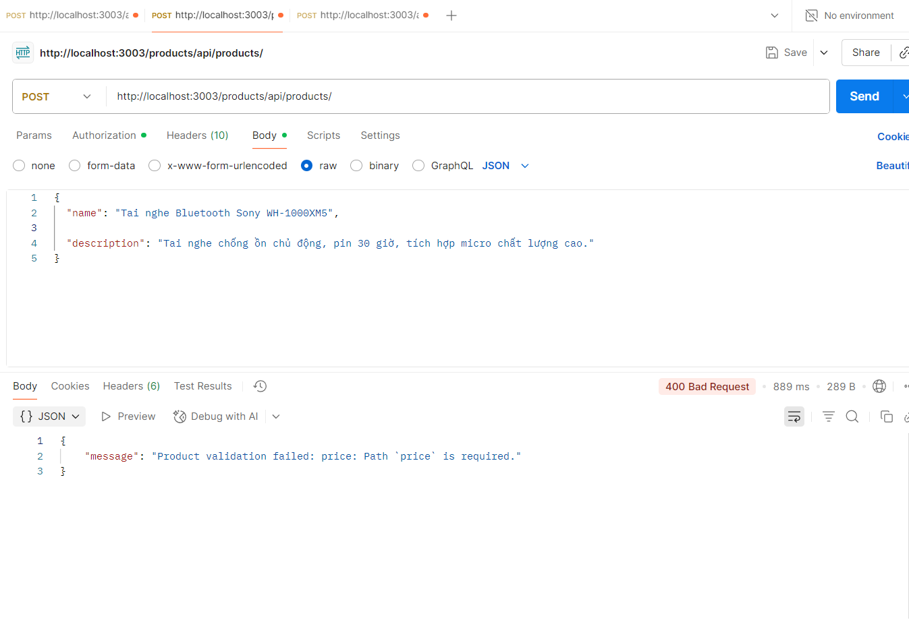

- GET DANH SACH PRODUCT 
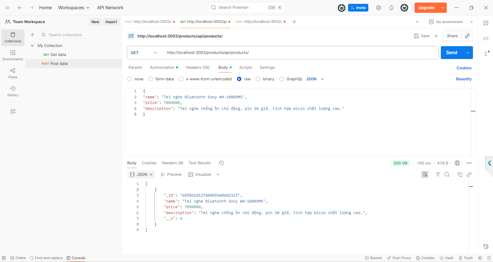

- ORDER 
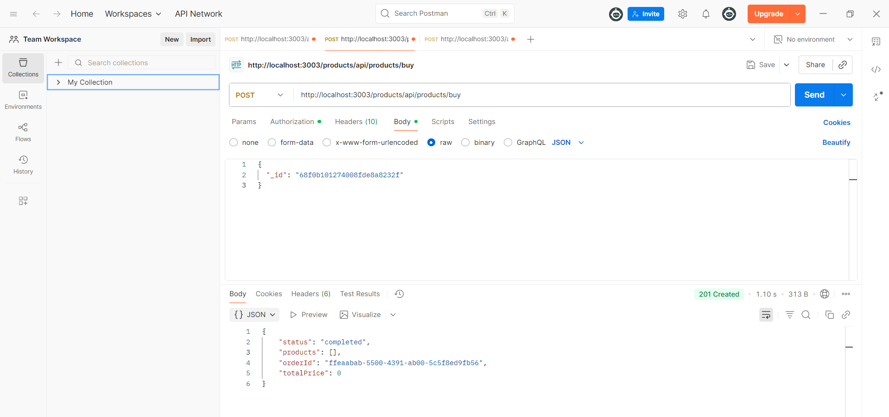
 
- SHOW MONGODB 
docker exec -it mymongodb mongosh
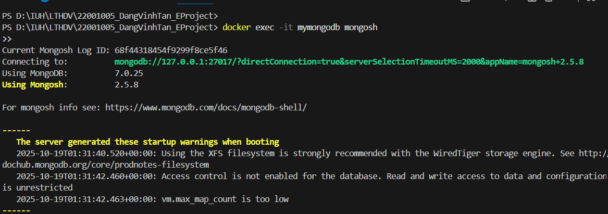
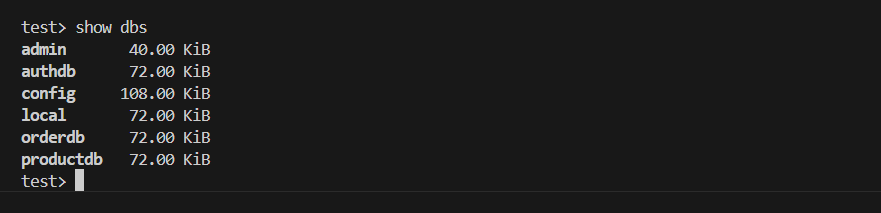
- USER
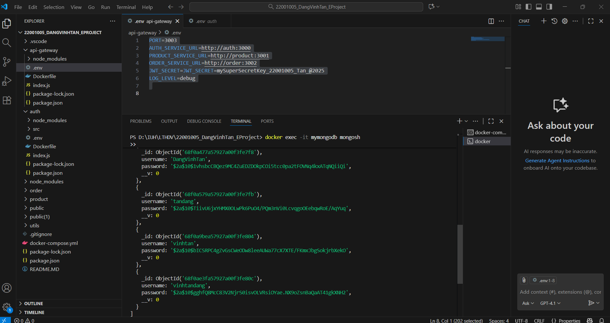
- PRODUCT
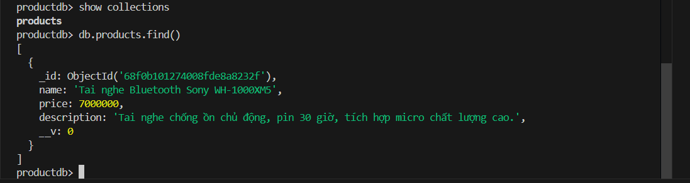
- ORDER
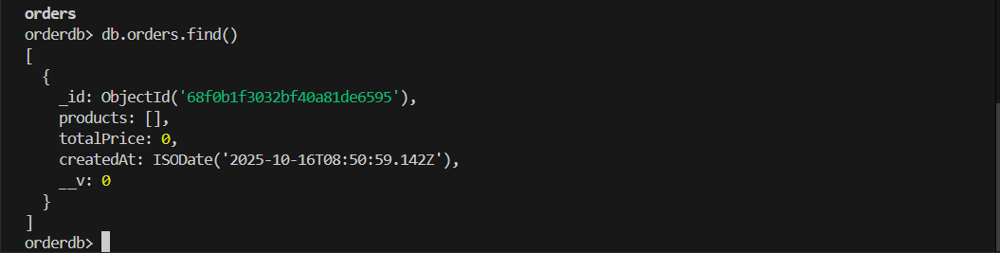

docker ps

docker-compose up --build

- DOCKER
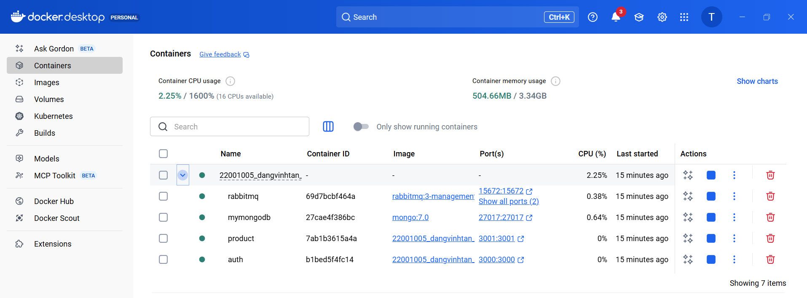
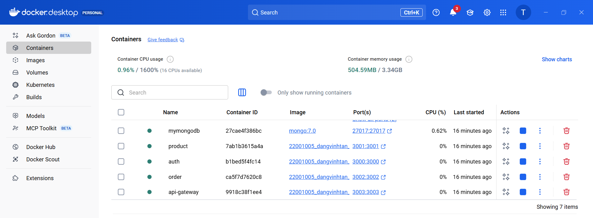
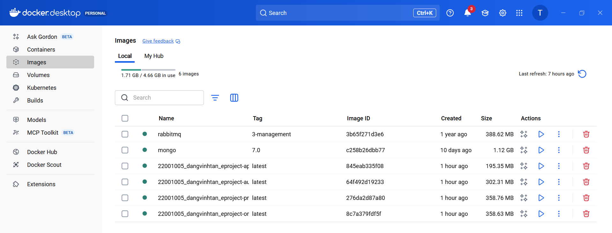
- Thao tác với github Action: Thực hiện CI/CD với dự án
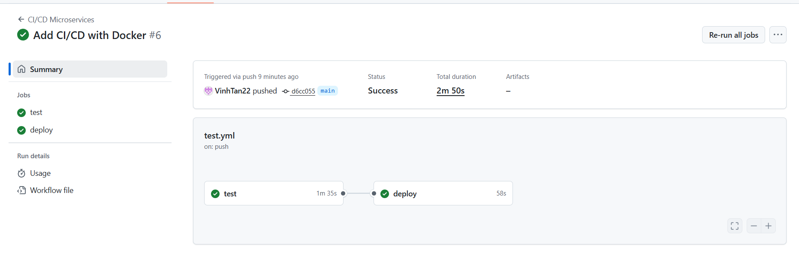
- CI/CD liên kết với Docker
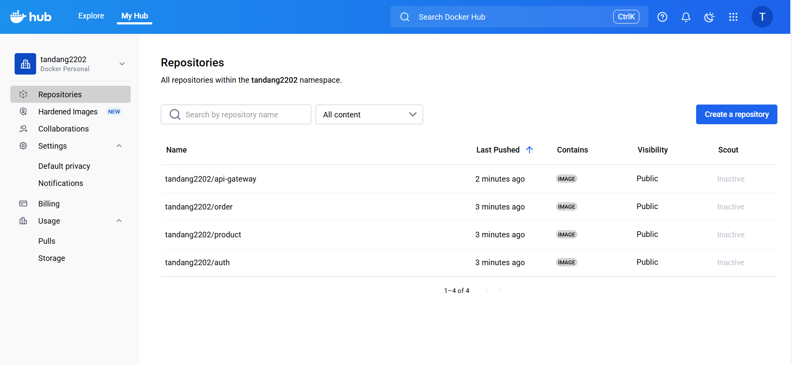 

